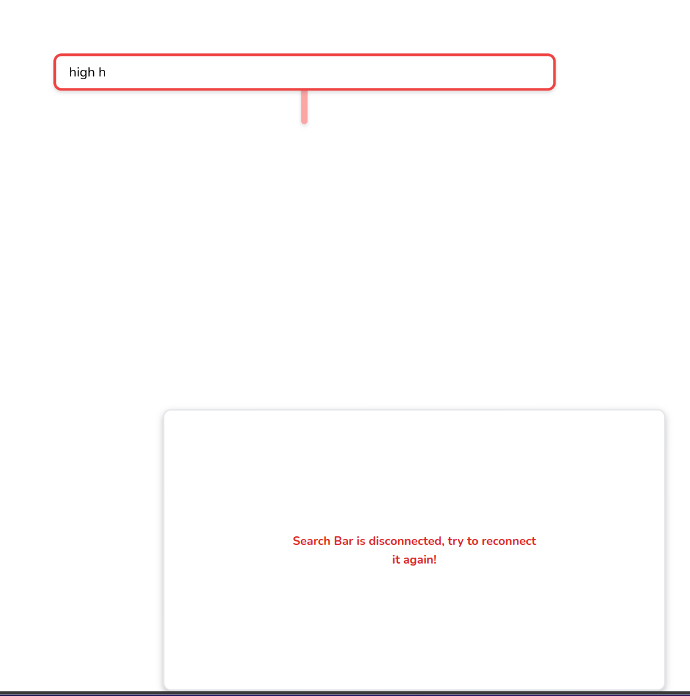

# Music Finder

Made for Hackathon with Lewis 2024

## ❓️What does it do?

When you search over a random number characters, the result box will fall to the bottom of the page, you have to drag it back to reconnect the wire under the search bar.

## 🚀️ Built with

- matter.js (physics engine)
- Sveltekit (web framework)
- TailwindCSS (CSS framework)
- Youtube API (for the music data) **(If you run it locally, you need to use your own API key)**

## 🎥 📸 Demo





## 📦️ Installation

```
pnpm install
pnpm run dev
```
