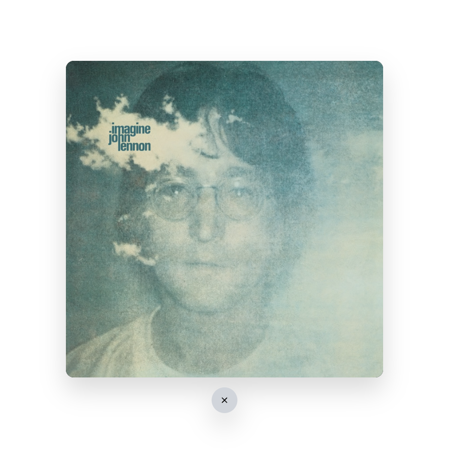

# Hackathon with Lewis 2024
[Project Link](https://lewis-hackathon.vercel.app/)

## ❓️What does it do?

When you searching over a random number of characters, the result box will fall down to the bottom of the page, so you have to drag it back to reconnect the wire under the search bar.

You can click the result to play music.

## 🚀️ Built with

- matter.js (physics engine)
- Sveltekit (web framework)
- TailwindCSS (CSS framework)
- Youtube API (for the music data)

## 🎥 📸 Demo

[demo_video.webm](https://github.com/user-attachments/assets/925e8e3f-8a3c-4de6-a028-9352f3b6af6c)
<div style="display: flex; gap: 10px; flex-wrap: wrap;">
  
  
  
</div>


## 📦️ Installation

```
pnpm install
pnpm run dev
```
